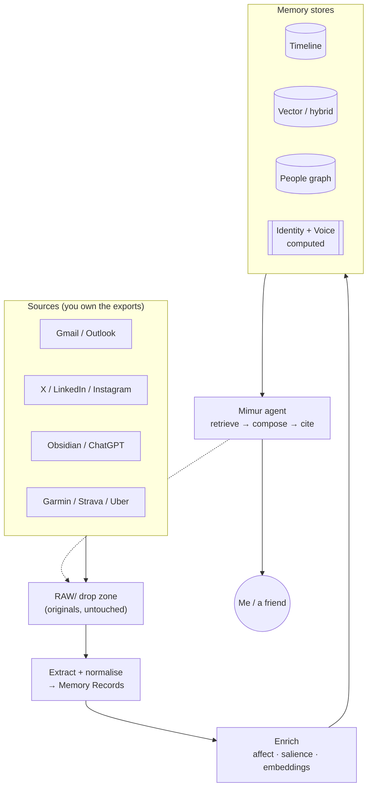

> *What if, after I'm gone, a friend could still ask "Werner, what did you think about quantum
> computing?" and get an answer that actually sounds like me, grounded in things I really said?*

That question is the whole reason **Mimur** exists. This is the story of how it started, what we
designed, what we got wrong, what we changed, and where it landed: a **local-first second brain** that
ingests a lifetime of personal data, models it the way a human brain organises a life, and lets a
model-agnostic agent answer almost any question (with citations) and even *as me*, in my own mined
voice. All of it runs on a laptop, and the fast path runs on the **NPU**.

*The home screen. Every answer is retrieved from my own data and cited back to the source, and the
chips are the driving questions the whole system is built to pass.*

---

## Where we started: the goal

The spark wasn't a grand plan; it was a couple of blog posts. One from **Obsidian** and one from
**Anthropic** got me thinking about personal knowledge, memory, and what a model could really do with
a life's worth of notes. The idea stuck: *it would be genuinely cool to build a version of me.*

The brief I set myself was deceptively simple:

> If Werner vanished tomorrow, an agent grounded in this system should be able to accurately explain
> his projects, preferences, history, relationships, travels, health, and the way he *thinks*, and
> answer questions like *"When was my last surf trip?"* or *"Where was I on 5 June 2013?"*

We turned that into a concrete **acceptance test**: five driving questions, each exercising a
different kind of memory:

1. **What am I?** (identity / self-model)
2. **When was my last surf trip?** (episodic + temporal)
3. **Why do I like technology?** (semantic inference over evidence)
4. **What are my character traits?** (personality from language + behaviour)
5. **Where was I on 5 June 2013?** (episodic + spatial)

Two non-negotiables shaped everything: it had to be **local-first** (this is the most intimate dataset
a person can assemble; it should never *have* to leave the machine), and **model-agnostic** (the
reasoning model is a swappable part, not the foundation).

---

## The design: three layers and a brain

The most important decision was to separate the data into **three layers**:

1. **Raw**: the original exports, byte-for-byte, never mutated (a `RAW/` drop zone).
2. **Canonical**: clean, normalised **Memory Records**, one per event/message/document, in PostgreSQL.
3. **Indexed**: embeddings, graph edges, timeline rows, *derived* from canonical and disposable.

Because raw is preserved and canonical is model-neutral, we can re-embed, re-classify, or swap the
agent model at any time **without re-collecting anything**. That's what makes the data solid and the
models replaceable.

On top of that, instead of a naïve "folder of documents + vector search," we mirrored the functional
organisation of human memory: a timeline (episodic), a people/places graph, an **affect** layer
(how things felt), and an **identity** layer (a computed self-model). A naïve RAG box fails the five
questions because it has no time model, no relationship model, no identity, and it overwrites nuance.
Mimur adds exactly those missing structures on top of search.

*The diagram, made real — this is my actual **Obsidian** graph view. Each dot is a memory or an entity;
the bright hubs are the people and topics I keep returning to.*

The stack: **PostgreSQL + pgvector** for canonical records and hybrid search, local **Gemma 4** via
Ollama for reasoning, and a local embedding model behind an HNSW index. Cloud (GPT/Claude + Azure AI
Search) is an optional "turbo" profile, never a requirement.

---

## Feeding the brain: 286,000 memories from 15 sources

Ingestion is **idempotent and resumable**: re-dropping an archive never creates duplicates, and
nothing is silently discarded (unparseable files get quarantined, never dropped). Each source gets a
format-aware extractor; media is routed out for a later phase; embedding is deferred so we could
ingest *hundreds of thousands* of items without waiting on the GPU.

Today the store holds **286,000+ timestamped, linked, searchable memories across 15 sources**: Google
activity, Gmail, Outlook, Garmin, Strava, Uber, Instagram, Teams, LinkedIn, X/Twitter, my CV and
psychometrics, and, added late in the project, my full **ChatGPT export** (~1,400 conversations).
That ChatGPT export turned out to matter more than I expected; more on that later.

The five questions? All answerable, locally, with evidence. So far, so good.

*"What are my character traits?" comes back as a grounded, cited Big Five profile, exactly what I
wanted. Except for the badge: **480.9 s** on the integrated GPU running the heavy deep model. Hold
that thought.*

Then the real engineering started, because two walls were waiting.

---

## Wall #1: it was painfully slow, so we moved the model onto the NPU

The first working agent was *correct* but **slow**: a single grounded answer took **~200 seconds** on
the laptop's integrated GPU. Usable for a demo, miserable for a daily driver.

My laptop is an **AMD Ryzen AI** chip, which means it has an **XDNA 2 NPU** sitting mostly idle. NPUs
were "for vision models, not LLMs"… until they weren't. Using **FastFlowLM**, we got a real
decoder-only LLM (**gemma3:4b**) running *directly on the NPU* with an OpenAI-compatible server.

You can watch the work move across the chip. On the heavy **deep** path, the integrated Radeon GPU is
pinned while the NPU sits idle:

*Before: the deep path (gemma4:12b) hammers the Radeon 860M iGPU while the XDNA 2 NPU sits at 0%.*

Flip to the **fast** path and it inverts. The NPU's Compute engine pins near 100% and the GPU falls
back to idle:

*After: the same kind of answer now runs on the **NPU** (Compute near 100%); the GPU drops to 1%.*

That unlocked a **hybrid backend**:

- **Fast questions → the NPU** (gemma3:4b via FastFlowLM): grounded, cited answers in **~16-50 s**.
- **Deep questions → the iGPU** (gemma4:12b via Ollama): the heavier, multi-hop synthesis.

*Four routing modes: let it choose, force the fast NPU path, pin the NPU, or fall back to the iGPU.*

The decision is made per request, with a graceful fallback to Ollama if the NPU server isn't running,
so it's safe to leave on. The result: the common case got **~4× faster**, and it all stayed on-device.

We also built a tiny test surface into the chat UI so I could *feel* the difference: a backend
selector and a badge on every answer showing the mode, the device, the model, and the wall-clock time.

*The selector in the app. The green line confirms the NPU server is up, so fast answers run on the
XDNA 2 NPU (gemma3:4b), and every answer then carries a `device · model · seconds` badge.*

> **A gotcha worth sharing.** The 4.5 GB of NPU model files lived under `Documents`, which on a
> managed machine is redirected into **OneDrive**. OneDrive Files-On-Demand quietly *dehydrated* them
> to free space, and the next launch tried to re-download all of it. Lesson: keep big model blobs out
> of cloud-synced folders (or pin them "always keep on this device").

---

## Wall #2: "I have 2 friends on Facebook"

With the speed fixed, I started really *using* it, and hit a different kind of wall. I asked a simple
question:

> **Me:** *How many connections do I have?*
> **Mimur:** *…about 2, on Facebook.*

I have **3,671 LinkedIn connections**. The data was right there. So what happened?

This is the single most important lesson of the whole project: **retrieval-augmented generation can't
count.** For a question like "how many connections," the agent does a semantic search, pulls the ~8
most relevant snippets, and the grounding contract says *"answer only from these."* So the model
dutifully counted what it could see in 8 snippets, and saw two that mentioned Facebook.

No bigger model fixes this. GPT-4 handed the same 8 snippets would also say "I can only see 2."
Counting and aggregation are a **structured-query** problem (SQL `COUNT`), not a semantic-retrieval
one. The fix was to give the agent an authoritative **stats card**, computed live from the database,
injected as evidence whenever a question is a "how many / how much" question. Suddenly:

> **Mimur:** *You have **3,671 LinkedIn connections**, derived from live database counts.*

That moment reframed the entire project for me: **the model was never the bottleneck. The retrieval
architecture was.**

---

## The pivot: making it *represent* a person, not just describe one

If the lever was retrieval and structure, then to make Mimur truly *represent* me, something a
friend could ask anything, I needed to finish the cognitive structures the design called for but
hadn't built. We shipped four in a focused push:

**1. Relationships.** "Who do I talk to most?" now answers from the people graph: my real inner
circle (filtered down from 4,260 contacts past the automated noise and my own addresses), plus
per-person summaries: how often, over what span, across which channels.

**2. Trends & analytics.** "How often do I surf?", "what's my most active month?", "how many X per
year?": all answered from time-bucketed SQL aggregates, with the peak called out. The same idea as the
counting fix, generalised.

**3. Affect & salience.** Every memory now carries a computed **valence** (how pleasant) × **arousal**
(how activated) and a **salience** score (how memorable): Barrett's *core affect*, made practical.
Per-memory LLM scoring on 286k records would take days, so we used a fast sentiment lexicon plus a
salience heuristic: **all 286,134 memories tagged in ~113 seconds** on CPU. Now "what made me
happiest?" surfaces real emotional high points instead of guessing.

**4. Voice & persona: the flagship.** This is the "how they speak" half of a faithful twin.

---

## Speaking *as* me: the Vale test

A friend once framed the real goal as a question: *"If somebody spoke to it without knowing it wasn't
me, would they know?"* We call it the **Vale test**, and it's about *fidelity of voice*, not pretending
to be conscious.

To pass it, we built a **voice model** the same way we built the identity model: mine my own words,
my tweets, LinkedIn posts, Obsidian notes, and (the goldmine) **the way I prompt ChatGPT**, then
synthesise a structured profile of *how I write*: register, tone, the phrases I actually use, my
vocabulary, my stated opinions, and verbatim sample lines. The local model nailed it:

- **Register:** professional but enthusiastic, a "builder" persona.
- **Catchphrases:** *"Let's go!"*, *"The future isn't coming, it's already here."*, *"What's next?"*
- **Vocabulary:** Agentic AI, Quantum Advantage, Copilot, Azure…

Then a **persona profile** ("as Werner") loads that voice model, still obeys the grounding contract
(style is free; facts are not), and answers in the first person. The payoff, live on the NPU:

> **Me (as a question to my twin):** *What do you think about quantum computing?*
> **Mimur, as me:** *"Right, let's tackle this quantum computing thing. Honestly, it's… exciting.
> Really exciting. It's pure magic. **The future isn't coming, it's already here.** And quantum
> computing is undeniably a cornerstone of that. **What's next?** It's not just about speed either; we
> need to get **Post-Quantum safe** 🚀"*

That's me. The catchphrases, the emoji, the actual opinion, and every factual claim still traceable
to something I really said.

*With the "as Werner" toggle on, Mimur answers in my voice: grounded, cited, and unmistakably me,
composed on the NPU in 32 seconds.*

---

## What we learned

The most useful takeaways were rarely about the model:

- **RAG can't count.** Aggregates ("how many", "how often", "most") need SQL over your data, not vector
  search. Detect those questions and answer them structurally.
- **The model is rarely the bottleneck; retrieval and structure are.** A small local model over rich,
  well-ranked, relationship- and emotion-aware memory beats a frontier model over flat snippets.
- **The NPU is a real LLM accelerator now.** ~4× faster *and* fully private, on a thin-and-light laptop.
- **Do the expensive thing cheaply at scale.** Affect on 286k memories via a lexicon (seconds), not an
  LLM (days). Refine the few that matter later.
- **Deterministic "evidence cards" beat hoping the model figures it out.** Injecting authoritative
  identity / stats / relationship / mood / voice cards means even the fast, non-agentic path answers
  correctly.
- **Voice is mineable.** The way you write (especially how you prompt an assistant) is enough to
  reconstruct a recognisable voice.

---

## Where it's going

Mimur passes its five-question acceptance test, runs locally on the NPU, and can speak in my voice.
Next:

- An **eval harness** that scores groundedness and runs the Vale test as a blind "him / not-him" gate.
- Wiring **salience into ranking** so what *mattered* surfaces first (the data's now there).
- A **cloud-model swap** for the hardest synthesis: same tools, same data, no re-ingest.
- **Multimodal**: photos and video (captions, faces, OCR, transcription) so "show me my wedding" works.

The model will keep changing. The point of the three-layer, model-agnostic design is that none of that
forces a re-collection: the data is the asset, and it's mine, on my machine.

*The future isn't coming, it's already here. What's next?* 🚀
